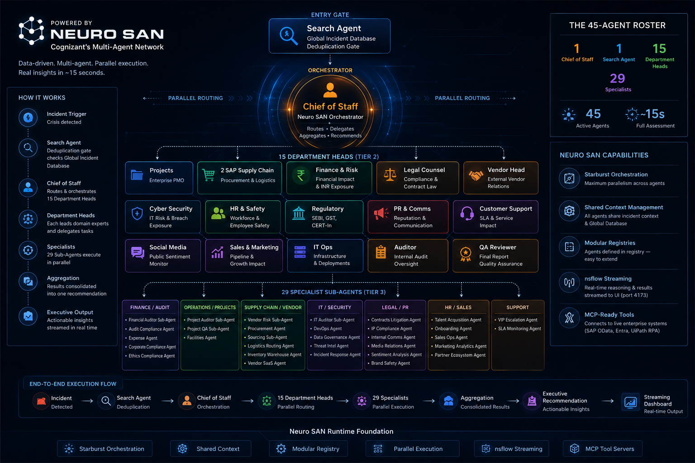
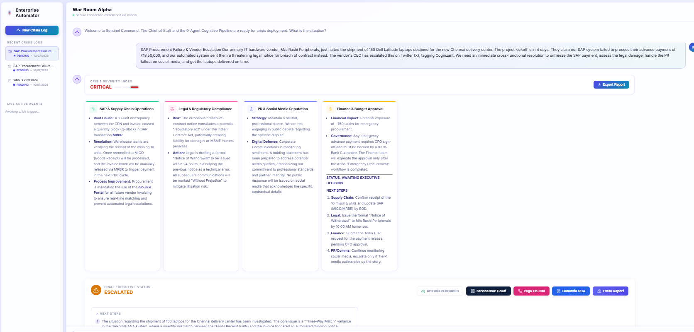
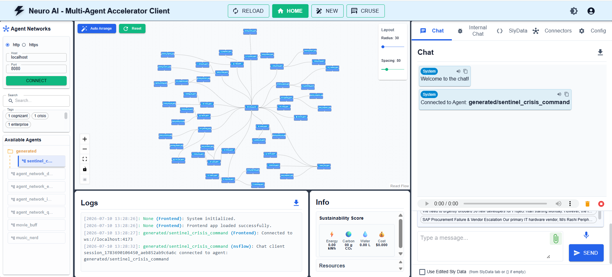
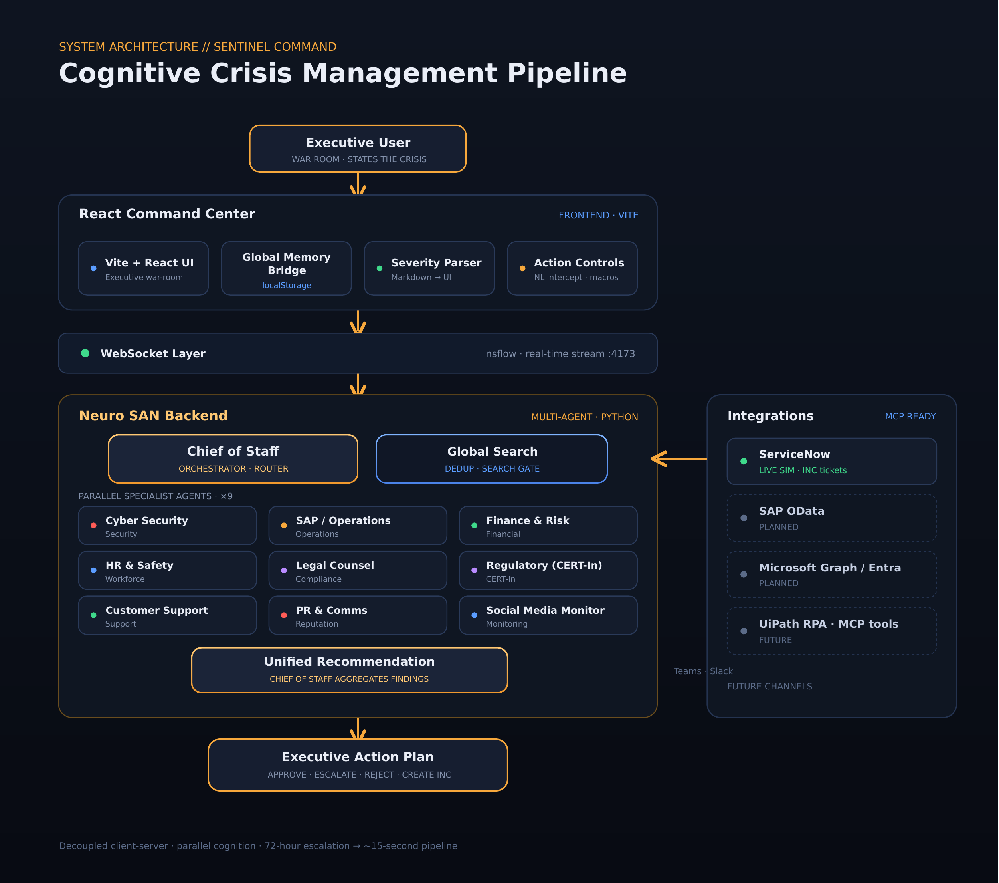
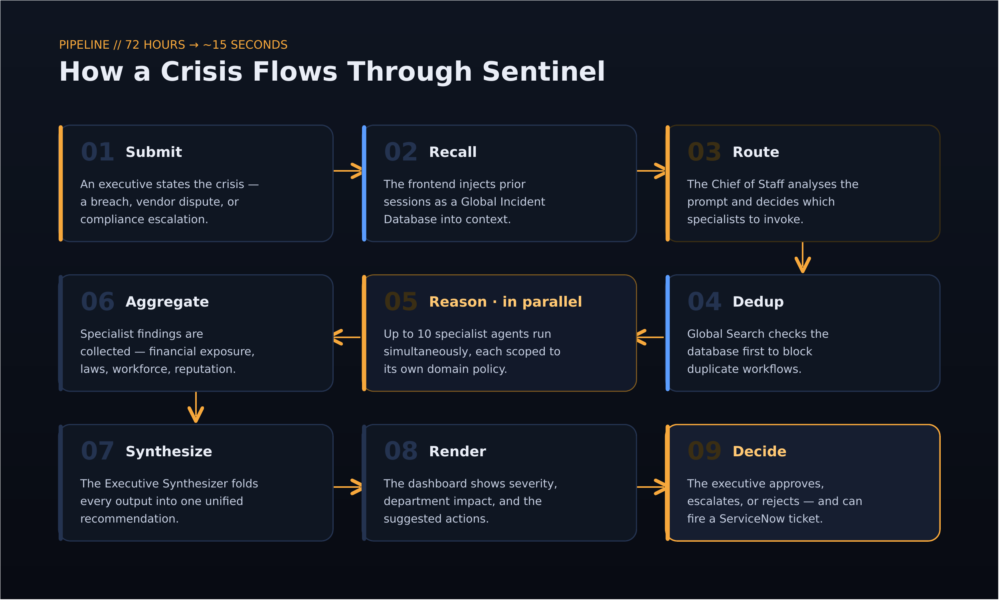

<div align="center">

# Sentinel Command

### The enterprise crisis war room, run by agents.

A **Cognizant Neuro SAN–powered** multi-agent platform that turns a 72-hour, email-driven escalation into a **~15-second autonomous pipeline**. An executive states the crisis; ten specialist agents reason **in parallel** and return one briefing with actions attached.

[](#powered-by-neuro-san)
[](#tech-stack)
[](#tech-stack)
[](#architecture)



</div>

<hr>

## Overview

**Sentinel Command** is an enterprise AI decision-intelligence platform built on Neuro SAN. Submit a security incident, vendor approval, compliance escalation, or risk assessment, and instead of pinging departments one by one, Sentinel routes it to the specialists that matter, analyzes impact **in parallel**, and returns a single, executive-ready recommendation with **Approve / Escalate / Reject** built in.

## Screenshots

<table>
<tr>
<td width="50%" valign="top">

<div align="center"><sub><b>React Command Center</b> — war-room UI with the 10-agent roster and live crisis logs</sub></div>
</td>
<td width="50%" valign="top">

<div align="center"><sub><b>Neuro SAN backend</b> — Chief of Staff orchestrating specialists in the multi-agent client</sub></div>
</td>
</tr>
</table>

## Powered by Neuro SAN

[Neuro SAN](https://github.com/cognizant-ai-lab/neuro-san) is Cognizant's framework for **data-driven, multi-agent networks** — agents are declared in a registry and the framework handles routing, delegation, and communication between them. Sentinel is not a single-prompt chatbot; it is a real agent network.

**Neuro SAN capabilities Sentinel uses**

| Capability | How Sentinel uses it |
|---|---|
| **Agent orchestration & delegation** | A `Chief of Staff` orchestrator analyses each crisis and delegates sub-tasks to the specialist agents that are relevant |
| **Parallel execution** | Specialists run concurrently instead of sequentially — full assessment in ~15s instead of hours |
| **Shared context management** | The crisis prompt and the injected `[GLOBAL INCIDENT DATABASE]` are shared across the network |
| **Modular registries** | Every agent is defined in a registry (`generated/sentinel_crisis_command`) — new specialists snap in without code changes |
| **nsflow streaming** | Agent reasoning and final markdown stream to the UI in real time over port `4173` |
| **MCP-ready tools** | Model Context Protocol servers can add live tools (SAP OData, Microsoft Entra, UiPath RPA) |

**Run the agent network**

```bash
nss run --registry generated/sentinel_crisis_command
```

## Agent network

The **Chief of Staff** invokes specialists simultaneously; each is scoped to its own domain policy, and their outputs are aggregated into one recommendation.

| Agent | Responsibility |
|---|---|
| **Chief of Staff** | Orchestrator — routes the crisis, invokes specialists, aggregates the final recommendation |
| **Global Search** | Deduplication gate — checks the Global Incident Database before work begins |
| **Cyber Security** | Security analysis and breach exposure |
| **SAP / Operations** | Business continuity and SAP operations impact |
| **Finance & Risk** | Financial impact and risk exposure |
| **HR & Safety** | Workforce and employee-safety impact |
| **Legal Counsel** | Compliance review and contract-law evaluation |
| **Regulatory (CERT-In)** | Regulatory and statutory reporting (e.g. CERT-In directions) |
| **Customer Support** | Customer and service-impact assessment |
| **PR & Comms** | Reputation and communications risk |
| **Social Media Monitor** | Public sentiment and social-media monitoring |

## Architecture

A decoupled client–server design: a Vite + React command center streams over WebSockets into a Python Neuro SAN backend, with a memory bridge that injects prior sessions into every request.

<div align="center">

</div>

- **Global Memory Bridge** — compiles prior sessions and ServiceNow IDs from browser storage into a `[GLOBAL INCIDENT DATABASE]` block, injected into context before the request hits the backend.
- **Severity parsing engine** — reads the markdown stream to detect `CRITICAL / MEDIUM / LOW` and mount the matching UI (severity meter, impact panels, action buttons).
- **Natural-language intercept** — catches intents like "create a ServiceNow ticket" and runs them as deterministic UI macros, bypassing the LLM for speed.

## How it works

<div align="center">

</div>

1. **Submit** — an executive states the crisis.
2. **Recall** — incident memory is retrieved from the Global Incident Database.
3. **Route** — the Chief of Staff analyses the prompt.
4. **Dedup** — Global Search checks for duplicate crises.
5. **Reason** — the ten specialists execute in parallel.
6. **Aggregate** — findings are collected from every domain.
7. **Synthesize** — the Chief of Staff folds them into one recommendation.
8. **Render** — the dashboard shows severity, impact, and actions.
9. **Decide** — the user approves, escalates, or rejects (and can fire a ServiceNow ticket).

## Key features

- **Multi-agent orchestration** — specialists reason in parallel under one Chief of Staff
- **Persistent incident memory** — past incidents carry forward as a Global Incident Database
- **Duplicate detection** — Global Search blocks repeat crises before work starts
- **Severity classification** — automatic `CRITICAL / MEDIUM / LOW` tagging drives the UI
- **Real-time updates** — live WebSocket stream of agent reasoning
- **Agent-to-UI execution** — natural language triggers real, deterministic UI actions
- **Enterprise integration ready** — ServiceNow today; SAP, Graph, and MCP tools next

## Tech stack

| Layer | Technology |
|---|---|
| **Frontend** | React · TypeScript · TailwindCSS · Vite |
| **Backend** | Python |
| **AI framework** | Cognizant Neuro SAN |
| **Communication** | WebSocket · nsflow (`:4173`) |
| **LLM providers** | Gemini · Mistral AI |
| **Future integrations** | ServiceNow · SAP · Microsoft Graph · MCP tools |

## Getting started

```bash
# 1 · clone
git clone <repository-url>
cd Sentinel-Command-Center

# 2 · install
pip install -r requirements.txt
npm install

# 3 · run the Neuro SAN backend
nss run --registry generated/sentinel_crisis_command

# 4 · run the frontend
npm run dev
# open http://localhost:5173
```

Create a `.env` in the project root:

```env
GEMINI_API_KEY=your_gemini_api_key
MISTRAL_API_KEY=your_mistral_api_key
```

> Backend streams on `:4173` · UI serves on `:5173`.

## Roadmap

**Implemented** — multi-agent orchestration · executive dashboard · persistent incident memory · duplicate detection · severity classification · real-time communication · ServiceNow ticket simulation

**Planned** — ServiceNow & SAP integrations · Microsoft Graph · Teams & Slack · voice interface · autonomous remediation · live MCP tools (SAP OData · Entra · UiPath)

<hr>

<div align="center">


## Documentation

For a deeper walkthrough of the architecture, the agent flow, and the diagrams above, see the full design document:

- **[Sentinel Command — Design & Diagram Deep-Dive (Google Doc)](https://docs.google.com/document/d/1Ni__6pR5mU98QzPfoms7JqBp6fyoGb_RE0BPBaEZ-_I/edit?usp=sharing)**
- `docs/architecture.md` — technical architecture
- `docs/summary.md` — executive project overview


**Sentinel is not a chatbot** — it is active decision-support infrastructure, combining organizational memory, parallel reasoning, and Neuro SAN orchestration into one workflow.


Built at Cognizant · [Repository](https://github.com/maazcognizant/SentinelCommand) · [Issues](https://github.com/maazcognizant/SentinelCommand/issues)

</div>
